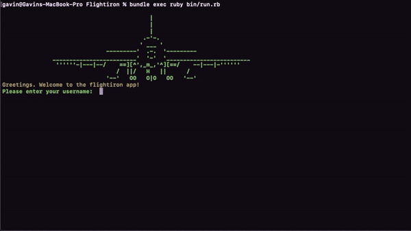
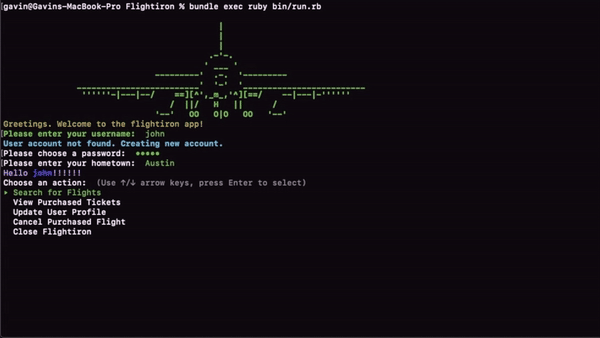
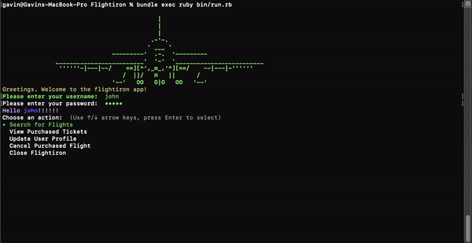
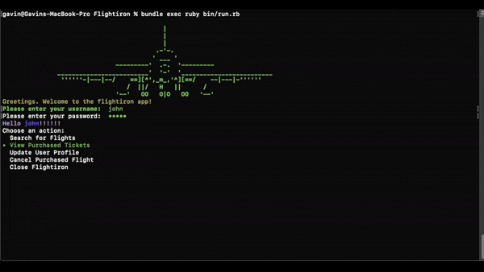

Module One Final Project
========================
Flightiron App - find your flights easily
----------------------------------------

# Introduction
Flightiron's goal is to make finding and selecting flights easy. Flightiron simplifies the user's experience by providing them with flight data and allowing them to select a 'flight', adding it to their 'ticket'

## Table of contents
* [Technologies](#technologies)
* [Setup](#setup)
* [Features](#features)
* [To Do](#to-do)
* [Project Status](#project_status)

## Technologies 
This project uses

* Ruby 2.6
* ActiveRecord 5.2
* Formatador
* tty-prompt
* colorize
* sqlite3 ~>1.3.6
* rake

## Setup
To run the program from terminal, you must:

```
 $ bundle install
 $ rake db:migrate
 $ rake db:seed
 $ bundle exec ruby bin/run.rb
```

### Features
* Create Account



* Select flights based on your requirements



* Veiw and cancel your tickets



* Change your information



* Navigate the command prompt using arrow keys

## To Do
* Make Usernames unique
* Option to find forgotten password
* Encrypt passwords
* Limit flights displayed at a time

### Project Status
Effort to implement to-do and add features for improved user experience
